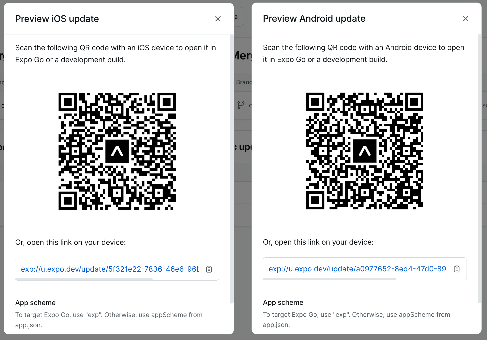

# DiagnoAkses
DiagnoAkses is a pre-diagnosis feature that provides information to healthcare facilities according to your needs.

The DiagnoAkses application can be tried via **Expo** for mobile and **Web Browser** through the following link:
- [**Expo** : https://expo.dev/accounts/ayusudi/projects/DiagnoAkses](https://expo.dev/accounts/ayusudi/projects/DiagnoAkses)  
  There is another option by scanning the QR code below, please adjust according to the operating system on your device.
  
- [**Web** : https://web-diagnoakses.web.app](https://web-diagnoakses.web.app)

For development, please checkout [➡️ API Documentation](https://documenter.getpostman.com/view/20472929/2s9YC1Vtv8)

## How to run it locally
1. Make sure you have Expo installed on your PC.
2. Make sure you have an iPhone simulator or Android emulator installed.
3. Open the simulator/emulator.
4. Open this folder in the terminal and run `npm install`.
5. Complete the Google environment credentials for Firebase Database and Geolocation which we utilize for the chat and map features.
6. Run:
   - `npm run ios` to run via iPhone simulator.
   - `npm run android` to run via Android emulator.
   - `npm run web` to run the application on localhost in the browser.
     For the web, we optimize and utilize the capabilities of React Native which can run on various platforms. However, our focus is on Android and iPhone mobile devices, as we see this opportunity presents a new challenge to make access as easy as possible.
7. If it's the first time running, Expo will be installed by the simulator/emulator itself.
8. If not, the simulator/emulator will directly load the application starting from the splash image [splash](./assets/splash.png).
9. Enjoy trying the features.

> For application submission via zip file, we will include the environment directly in the code.
> However, after this competition ends, we will disable this because of the budget constraints.

User Interface in the previous Prototype

However, after this application is completed, we successfully finished 7 pages which we allocate for:
1. Category List (Category Page) as the main page.
2. Symptom List (Symptom Page).
3. Pre-diagnosis (Pre-diagnose Page).
4. Pre-diagnosis Result (Pre-diagnosed Page).
5. Chat (Chat Page).
6. List of Health Facilities (MedFacility Page) with included map.
7. Location Filter List (Search Location Page).

## Source Data
We use our original API that we created through data entry, Kaggle dataset, data cleaning, normalization, and others.
Until creating the following API ["REST API DiagnoAkses"](https://github.com/SimpliLife/server).

Included is the Kaggle data processing which is a list of health facilities from 2019 in the following repository [click](https://github.com/SimpliLife/data-cleaning-kaggle).
Also, the processed data from data entry from our main source book which is processed into JSON and further processed with Python [click](https://github.com/SimpliLife/dataset-version-1).

API Documentation can be accessed through Postman which is also provided with usage examples.
[API DOC REST API DIAGNOAKSES](https://documenter.getpostman.com/view/20472929/2s9YC1Vtv8)

Our public server can be accessed via the following URL: [https://simplilife-d59aa106cc03.herokuapp.com/api](https://simplilife-d59aa106cc03.herokuapp.com/api)

